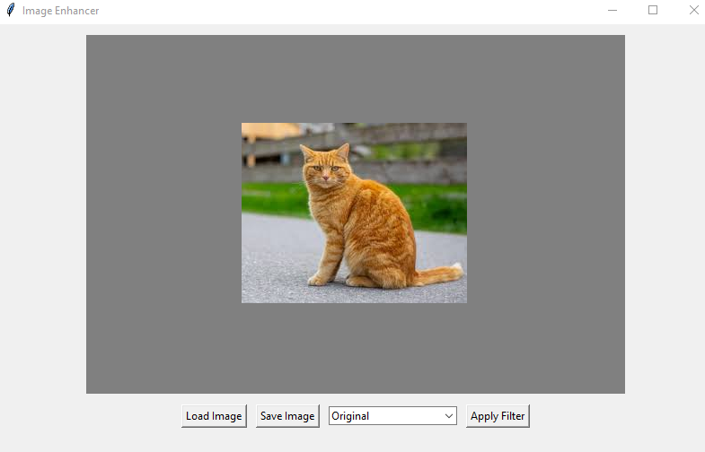
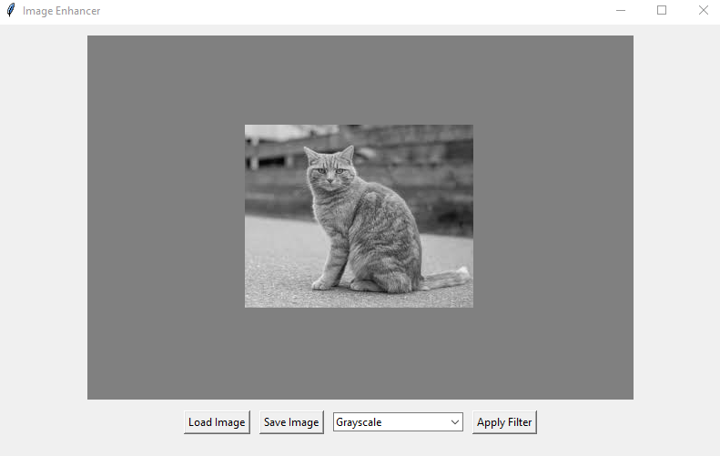

# Image_Filters_Tkinter
Python desktop application with a Tkinter GUI that allows loading, processing, and saving images

Features

-Load JPG/PNG/BMP images

-Apply filters: Grayscale, Blur, Sharpen, Edge Detection

-Detect faces in the image

-Save the processed image

Requirements:

-Python 3.8+

-OpenCV library (opencv-python)

-Pillow library (Pillow)
-Numpy

Installation

pip install opencv-python Pillow numpy

Run

python image_enhancer.py

Usage Instructions:

1.Click Load Image and select an image.

2.Choose a filter from the dropdown list.

3.Click Apply Filter to see the result.

4.Click Save Image to save the processed image.

Screenshots

